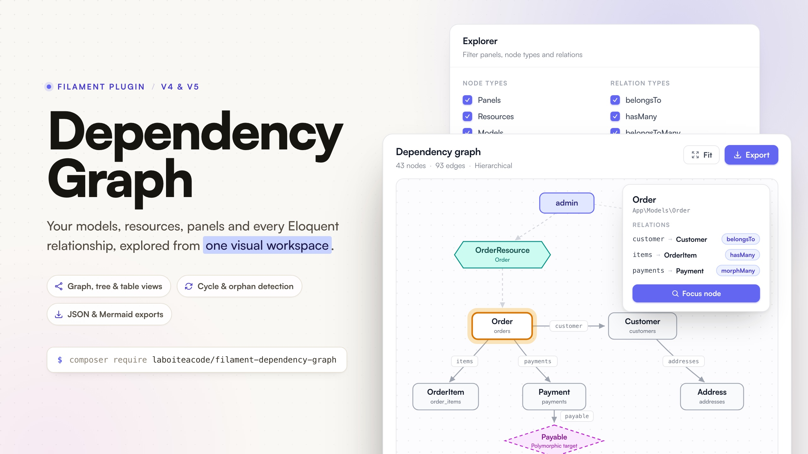

# Filament Dependency Graph

[](https://packagist.org/packages/laboiteacode/filament-dependency-graph)
[](https://github.com/la-boite-a-code/filament-dependency-graph/actions/workflows/tests.yml)
[](https://packagist.org/packages/laboiteacode/filament-dependency-graph)
[](LICENSE.md)

> The visual architecture explorer for Filament.

Explore models, resources, panels and relationships from one visual workspace. Filament Dependency Graph automatically discovers the structure of a Laravel and Filament application and presents it through an interactive, navigable interface: a graph, a tree, a table, a contextual inspector, search, focus mode, filtering and exports.



## The problem

Large Laravel and Filament applications are hard to understand because their structure is scattered across models, relationships, resources, panels, relation managers, policies, traits, casts and morph maps. A developer joining an existing project inspects dozens of files before understanding which models exist, how they connect, which resources expose them and where circular dependencies live. Static diagrams rot; manual documentation is never complete.

## The solution

Install the package, register the plugin, open one page, and immediately answer:

- Which models exist, and which resources expose them?
- Which panels contain those resources?
- How are the models connected, and through which relation types?
- Which models have no resource? Which are isolated?
- Where do circular dependencies exist?
- What surrounds this specific model?

## Features

- **Automatic discovery.** Eloquent models, relations, Filament panels, resources, pages and relation managers, with zero package-specific configuration on standard applications.
- **Every Eloquent relation type.** belongsTo, hasOne, hasMany, belongsToMany, hasOneThrough, hasManyThrough, morphTo, morphOne, morphMany, morphToMany and morphedByMany, including morph maps.
- **A readable graph.** Cytoscape.js with a layered dagre layout for the hierarchical mode and fCoSE for the force-directed mode. Relation labels only appear at readable zoom levels, selecting a node fades everything outside its neighborhood, and disconnected models are packed neatly instead of drifting over the graph.
- **Native Filament look.** The whole page is built from Filament components (sections, tabs, buttons, selects, checkboxes, badges) and the graph palette reads your panel color scales at runtime, in light and dark mode.
- **Tree and table views** for the same data, usable without the graph renderer.
- **Contextual inspector** for models, resources, panels and relation edges: keys, pivot tables, morph metadata, traits, casts, diagnostics.
- **Search** across class names, labels, tables, namespaces, panels and relation methods, with deterministic ranking.
- **Focus mode** with configurable depth and direction, shareable through the URL query string.
- **Filters.** Panels, node types, relation types, namespace, vendor or application ownership, orphans only, circular dependencies only, models without resources only.
- **Deterministic JSON and Mermaid exports**, from the UI or the CLI.
- **Snapshot cache** with dedicated artisan commands.
- **Full page customization.** Navigation label, icon, group, sort, badge, parent item, slug, cluster, max content width and access control - fluently or from the configuration file.
- **Read-only by design.** The package never modifies your application or queries business records.
- **Resilient discovery.** One broken model or throwing relation method becomes a warning, never a crash.

## Compatibility

The CI matrix is the source of truth.

| Package | PHP | Laravel | Filament |
| ------- | --- | ------- | -------- |
| 1.x     | 8.3, 8.4 | 12.x, 13.x | 4.x, 5.x |

## Installation

```bash
composer require laboiteacode/filament-dependency-graph
```

Register the plugin in your panel provider:

```php
use LaBoiteACode\DependencyGraph\DependencyGraphPlugin;

public function panel(Panel $panel): Panel
{
    return $panel
        ->plugins([
            DependencyGraphPlugin::make(),
        ]);
}
```

That is all: open `/admin/dependency-graph` in your local environment. The plugin can be registered on several panels, each with its own options.

## Security warning

Class names, table names and relationship metadata are sensitive architecture information. The page is only visible when `app()->isLocal()` returns true. Never expose it publicly.

To enable it elsewhere, take an explicit decision:

```php
DependencyGraphPlugin::make()
    ->canAccessUsing(fn (): bool => auth()->user()?->can('viewDependencyGraph') === true);
```

`visible()` is an alias of `canAccessUsing()`. The callback replaces the local-only rule entirely, so make it as strict as your context requires.

## The workspace

### Graph view

The default view renders the dependency graph with typed nodes: panels, resource hexagons, model boxes and dashed polymorphic-target diamonds. Two layouts are available from the toolbar:

- **Hierarchical** (default) - a layered dagre layout: panels on top, then resources, then models, with crossing minimisation.
- **Force-directed** - fCoSE, which clusters tightly related models together and packs disconnected components side by side.

Interactions: zoom and pan, drag nodes, click a node or an edge to open the inspector (the rest of the graph fades to keep focus), click the canvas to clear, `Fit` to re-center. Relation labels appear once the zoom makes them readable.

### Tree view

A cycle-safe, depth-limited expansion of the graph starting from the panels (or from the selected node), with the relation method displayed on every branch. Useful for answering "what hangs off this model" linearly.

### Table view

Three sortable tables - models, relations, resources - with counts, foreign keys, pivot tables, navigation groups and discovery status badges. Every row opens the inspector.

### Inspector

Selecting a node or an edge opens a side panel with everything the discovery collected: namespace, table, primary key, soft deletes, traits, casts, relation list with types and keys, pivot metadata, morph maps, panels and pages for resources, plus diagnostics when discovery was partial.

### Focus mode

Press `F` (or the inspector button) to restrict the graph to the neighborhood of the selected node, with a configurable depth (1, 2, 3 or unlimited) and direction (incoming, outgoing or both). The focus state lives in the URL query string, so the exact view can be shared or bookmarked.

### Search

Press `/` and type: the search matches class names, labels, table names, namespaces, panel ids and relation methods, grouped by node type. Selecting a result clears the transient filters, selects the node and centers the graph on it.

### Keyboard shortcuts

| Key | Action |
| --- | ------ |
| `/` | Focus search |
| `Esc` | Close inspector or exit focus mode |
| `F` | Focus selected node |
| `R` | Reset graph |
| `G` | Graph view |
| `T` | Tree view |
| `L` | Table view |
| `E` | Export JSON |

## Scopes

- **Filament scope** (default): starts from the resources registered in the selected panels and includes their models plus related models up to the configured depth.
- **Laravel scope**: every discovered Eloquent model, including models that no resource exposes. Disable it entirely with `laravel_scope_enabled => false` or `->allowLaravelScope(false)`.

## Configuration

Publish the configuration file when you need to adjust discovery:

```bash
php artisan vendor:publish --tag=filament-dependency-graph-config
```

Every option, with its default:

```php
use LaBoiteACode\DependencyGraph\Domain\Enums\GraphScope;

return [
    // Master switch: hides the page everywhere, keeps the API and CLI working.
    'enabled' => true,

    // Navigation entry. Every key has a fluent twin on the plugin.
    'navigation' => [
        'label' => null,                  // defaults to the translated label
        'icon' => 'heroicon-o-share',
        'active_icon' => null,
        'group' => null,
        'sort' => null,
        'parent_item' => null,
        'register' => true,               // false keeps the route, hides the menu entry
    ],

    // Page placement and layout.
    'page' => [
        'slug' => 'dependency-graph',
        'cluster' => null,                // a Filament cluster class name
        'max_content_width' => 'full',    // any Filament\Support\Enums\Width value
    ],

    // Scopes.
    'default_scope' => GraphScope::Filament,
    'laravel_scope_enabled' => true,

    // Model discovery.
    'model_paths' => [app_path('Models')],
    'model_namespaces' => ['App\\Models\\'],
    'exclude' => [
        'classes' => [],
        'namespaces' => [],
        'tables' => [],
        'relations' => [],                // "App\Models\Order::customer"
    ],
    'vendor_models' => [
        'enabled' => false,
        'namespaces' => [],
    ],

    // Discovery behavior.
    'discovery' => [
        'relations' => true,
        'database_schema' => true,
        'docblocks' => true,
        // Calls untyped methods to check whether they return a relation.
        // Disabled by default: invoking arbitrary methods may trigger
        // application side effects.
        'heuristic_relation_invocation' => false,
    ],

    // Graph defaults.
    'graph' => [
        'default_depth' => 2,
        'default_direction' => 'both',
        'default_layout' => 'hierarchical',
        'show_panel_nodes' => true,
        'show_resource_nodes' => true,
        'show_orphans' => true,
    ],

    // Snapshot cache (bypassed automatically in the testing environment).
    'cache' => [
        'enabled' => true,
        'store' => null,
        'ttl' => 3600,
    ],

    // The page is local-only unless a visibility callback says otherwise.
    'authorization' => [
        'local_only' => true,
    ],

    // Built-in exporters.
    'exports' => [
        'json' => true,
        'mermaid' => true,
    ],
];
```

The plugin exposes the discovery knobs fluently:

```php
DependencyGraphPlugin::make()
    ->defaultScope(GraphScope::Filament)
    ->defaultDepth(2)
    ->allowLaravelScope()
    ->scanVendorModels(false)
    ->excludeModels([AuditLog::class])
    ->registerModelPath(app_path('Domain'))
    ->registerModelNamespace('App\\Domain\\')
    ->registerExporter(new MyGraphvizExporter())
    ->registerInspector(new MyAuditableInspector());
```

## Customizing the page

Navigation, page placement and layout follow the same conventions as the other La Boite a Code plugins. Everything is available fluently on the plugin, or under the `navigation` and `page` keys of the configuration file; the plugin wins when both are set:

```php
use Filament\Support\Enums\Width;

DependencyGraphPlugin::make()
    ->navigationLabel('Architecture')
    ->navigationIcon('heroicon-o-share')
    ->activeNavigationIcon('heroicon-s-share')
    ->navigationGroup('Developer tools')      // string, enum or closure
    ->navigationSort(30)
    ->navigationParentItem('Tooling')
    ->navigationBadge(fn (): string => 'beta')
    ->registerNavigation(false)               // keep the route, hide the menu entry
    ->slug('architecture-map')
    ->cluster(\App\Filament\Clusters\Developer::class)
    ->maxContentWidth(Width::SevenExtraLarge)
    ->canAccessUsing(fn (): bool => auth()->user()?->isDeveloper() ?? false);
```

The page renders **full width by default** so large graphs get the whole viewport; set `page.max_content_width` (or `maxContentWidth()`) to any `Filament\Support\Enums\Width` value to constrain it.

### Translations

Every label ships in English and French. Publish the language files to adjust or add locales:

```bash
php artisan vendor:publish --tag=filament-dependency-graph-translations
```

### Views

The Blade views are publishable for deep customization, although the stable extension points (exporters, inspectors, configuration) should cover most needs:

```bash
php artisan vendor:publish --tag=filament-dependency-graph-views
```

### Theming

The interface is built from the native Filament Blade components (sections, tabs, buttons, selects, checkboxes, badges) and the graph palette reads your panel color scales (`primary`, `success`, `info`, `warning`, `gray`) at runtime, so a custom Filament theme restyles the whole page - including the graph - without any extra work.

## Exports

From the UI: the toolbar downloads the current graph, filters included, as JSON or Mermaid.

From the CLI:

```bash
php artisan filament-dependency-graph:export
    {--format=json : Export format, json or mermaid}
    {--scope= : Graph scope, filament or laravel}
    {--panel=* : Only include the given panel ids}
    {--focus= : Focus on a node id, for example model:app.models.order}
    {--depth= : Focus traversal depth}
    {--direction=both : Focus direction, incoming, outgoing or both}
    {--output= : Write the export to this file instead of standard output}
    {--force : Overwrite the output file when it exists}
```

For example:

```bash
php artisan filament-dependency-graph:export \
    --format=mermaid \
    --scope=laravel \
    --output=docs/dependency-graph.mmd
```

Both exports are deterministic: same application state, same output. Diff them in CI to detect architecture drift, or commit the Mermaid file next to your documentation.

## Cache

Discovery relies on reflection and file scanning, so snapshots are cached. The cache stores the discovered snapshot only - never rendered output - and is bypassed automatically in the testing environment.

```bash
# Warm the cache, for example in a deploy pipeline
php artisan filament-dependency-graph:cache
    {--scope= : Discovery scope, filament or laravel}
    {--panel=* : Only discover the given panel ids}
    {--no-schema : Skip database schema inspection}
    {--force : Rebuild even when a cached snapshot exists}

# Clear every cached snapshot
php artisan filament-dependency-graph:clear
```

The cache key includes the package schema version, the runtime versions and every discovery setting, so configuration changes never serve stale graphs.

## Programmatic API

The facade proxies the `DependencyGraphManager` contract, so everything the UI does is scriptable:

```php
use LaBoiteACode\DependencyGraph\Domain\Enums\GraphScope;
use LaBoiteACode\DependencyGraph\Domain\ValueObjects\GraphQuery;
use LaBoiteACode\DependencyGraph\Facades\DependencyGraph;

// Raw discovery snapshot: models, relations, panels, resources, warnings.
$snapshot = DependencyGraph::discover();

// Full graph with the default query.
$graph = DependencyGraph::graph();

// Focused sub-graph.
$graph = DependencyGraph::graph(new GraphQuery(
    scope: GraphScope::Laravel,
    panelIds: ['admin'],
    focusNodeId: 'model:app.models.order',
    depth: 2,
));

$graph->nodeCount();
$graph->edgeCount();
$graph->toArray();

// Exports.
$json = DependencyGraph::export('json');
$mermaid = DependencyGraph::export('mermaid');

DependencyGraph::clearCache();
```

`GraphQuery` accepts the scope, panel ids, node types, relation types, a focus node with depth and direction, and whether orphans are included - the same capabilities as the UI filters.

## Extending

### Custom exporters

Implement the `GraphExporter` contract and register it on the plugin:

```php
use LaBoiteACode\DependencyGraph\Contracts\GraphExporter;
use LaBoiteACode\DependencyGraph\Domain\Graph\Graph;
use LaBoiteACode\DependencyGraph\Domain\ValueObjects\ExportOptions;

class GraphvizExporter implements GraphExporter
{
    public function format(): string
    {
        return 'dot';
    }

    public function export(Graph $graph, ExportOptions $options): string
    {
        // Walk $graph->nodes and $graph->edges, return DOT markup.
    }
}

DependencyGraphPlugin::make()
    ->registerExporter(new GraphvizExporter());
```

The format becomes available in the UI and through the facade on panel requests. For console usage (`--format=dot`), register the exporter in a service provider instead, by resolving `LaBoiteACode\DependencyGraph\Export\ExportManager` and calling `register()` - the plugin only boots with its panel.

### Custom inspectors

Implement the `NodeInspector` contract to enrich (or replace) the inspector panel for the nodes you care about. Custom inspectors are consulted before the built-in ones:

```php
use LaBoiteACode\DependencyGraph\Contracts\NodeInspector;

DependencyGraphPlugin::make()
    ->registerInspector(new MyAuditableInspector());
```

## Troubleshooting

- **The page returns 404 outside your machine.** Expected: the page is local-only by default. Configure `canAccessUsing()` deliberately (see the security warning).
- **The graph looks unstyled or outdated after an update.** Republish the Filament assets: `php artisan filament:assets`.
- **Some models are missing.** Discovery scans `model_paths` and `model_namespaces`; add your custom locations there or with `registerModelPath()` / `registerModelNamespace()`. Vendor models are excluded unless `vendor_models.enabled` is true.
- **A relation is not detected.** Untyped relation methods are only discovered through docblocks (enabled by default) or heuristic invocation (disabled by default, because it calls the methods). Add a return type to the relation method for the most reliable detection.
- **A model shows a warning badge.** Discovery is resilient: the inspector's diagnostics section lists exactly what failed for that class.

## Testing

```bash
composer test
composer analyse
composer lint
```

The suite runs on Pest with Orchestra Testbench against a realistic fixture domain covering every supported relation type, multi-panel resources and failure scenarios.

## Architecture

The codebase is layered: a framework-agnostic domain (graph model, DTOs, algorithms), an application layer (use cases), infrastructure (discovery, cache, exporters) and a Filament presentation layer. Filament 4 and 5 differences are isolated behind a compatibility adapter. Architecture decision records live in [docs/adr](docs/adr).

## Changelog

See [CHANGELOG.md](CHANGELOG.md) for release notes.

## Contributing

See [CONTRIBUTING.md](CONTRIBUTING.md). Please report security issues privately as described in [SECURITY.md](SECURITY.md).

## Credits

- [Alexandre Ribes](https://alexandre-ribes.fr)
- [La Boîte à Code](https://laboiteacode.fr)
- [Cytoscape.js](https://js.cytoscape.org), [dagre](https://github.com/dagrejs/dagre) and [fCoSE](https://github.com/iVis-at-Bilkent/cytoscape.js-fcose) for the graph rendering and layouts
- The [Filament](https://filamentphp.com) team for the UI foundation

## License

Open source under the [MIT license](LICENSE.md).
